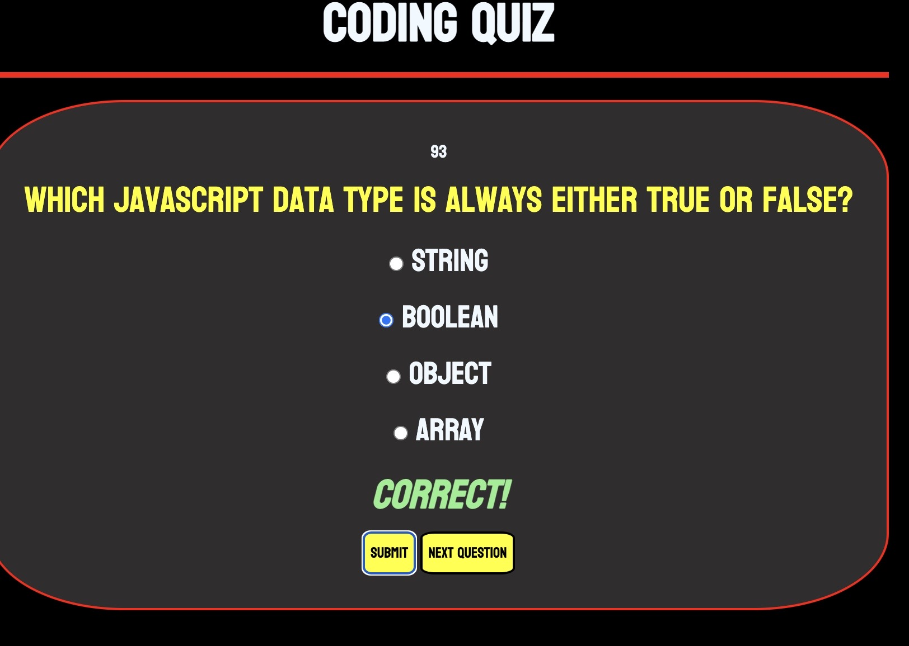
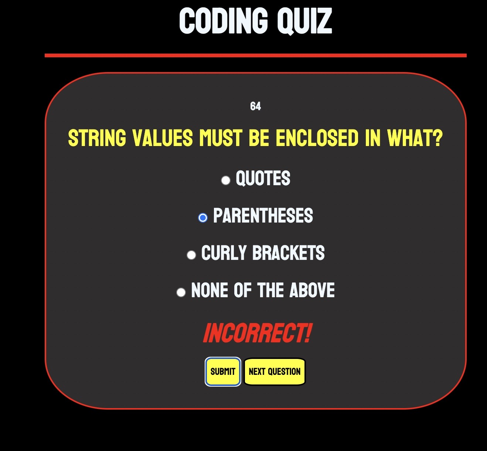

# api-codequiz-challenge

## Purpose

A timed quiz that tests user's knowledge of JavaScript. When user answers correctly, they gain 20 points. If user answers wrong, they lose 10 seconds on their time. At the end of the quiz, the user will be given a score and taken to the high scores page.

## Built With
* Html
* CSS
* JavaScript

## Website

https://cdonais.github.io/api-codequiz-challenge/

## Screenshots

